






I'm now a Ph.D. candidate in [School of Intelligence Science and Technology ](https://www.cis.pku.edu.cn/index.htm) at [Peking University](https://www.pku.edu.cn/), working with Prof. [Yan Zhang](http://www.cis.pku.edu.cn/jzyg/szdw/zy.htm). I obtained my bachelor's degree from the [School of Computer Science and Engineering](https://www.scse.uestc.edu.cn/), [UESTC](https://www.uestc.edu.cn/) in June 2021, under the supervision of Prof. [Kai Zheng](http://zheng-kai.com/). I’ve also spent time at [Baidu](http://research.baidu.com/), [MSRA](https://www.msra.cn/), [Alibaba](https://www.alibaba.com/) and [Huawei](https://www.huawei.com/).

My current research interests include **Information Retrieval** and **Large Language Models**. If you are also interested, please feel free to drop me an email.

# 🔥 News
- *2024.04*: &nbsp;🎉🎉  Nominated for the Academic Star Award!
- *2023.12*: &nbsp;🎉🎉  My paper entitled “Towards Verifiable Text Generation with Evolving Memory and Self-Reflection” is available on [Arxiv](http://arxiv.org/abs/2312.09075)!
- *2023.10*: &nbsp;🎉🎉  My paper entitled “LEAD: Liberal Feature-based Distillation for Dense Retrieval” was accepted by [WSDM 2024](https://www.wsdm-conference.org/2024/)! 
- *2023.10*: &nbsp;🎉🎉  My paper entitled “Allies: Prompting Large Language Model with Beam Search” was accepted by [EMNLP 2023](https://2023.emnlp.org/)!
- *2023.08*: &nbsp;🎉🎉  Awarded as Stars of Tomorrow during an internship at Microsoft!

# 📒 Preprint

Arxiv
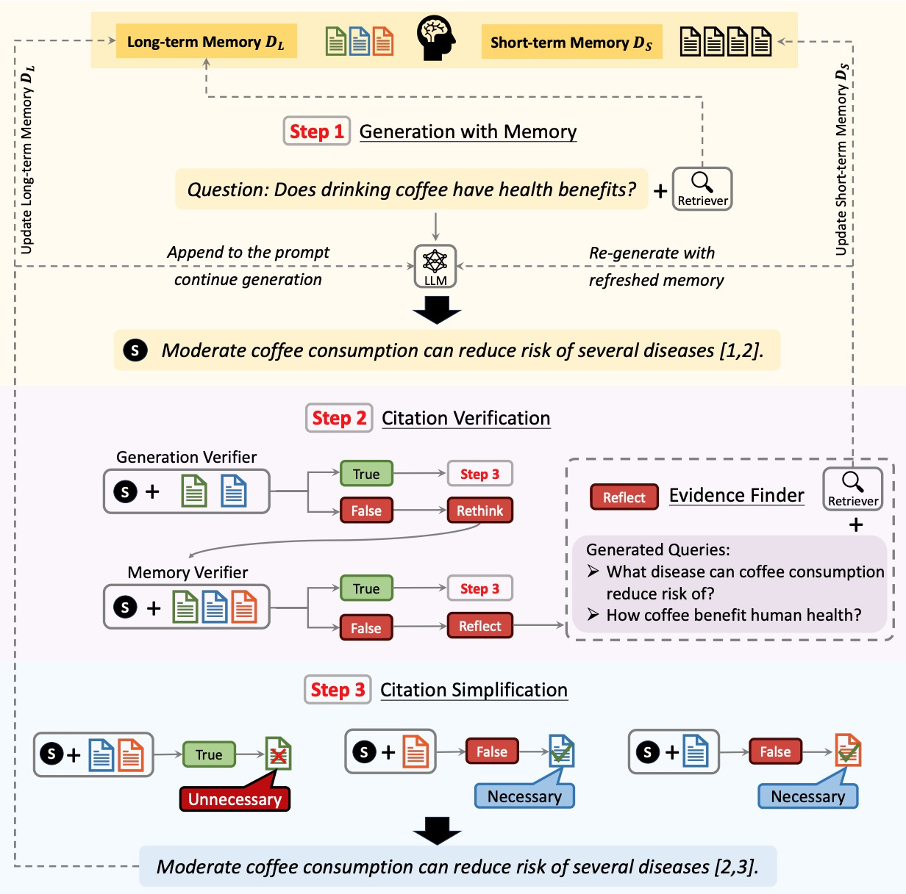

[Towards Verifiable Text Generation with Evolving Memory and Self-Reflection](https://arxiv.org/pdf/2312.09075.pdf) 
**Hao Sun**, Hengyi Cai, Bo Wang, Yingyan Hou, Xiaochi Wei, Shuaiqiang Wang, Yan Zhang, Dawei Yin 

**Arxiv** 

 <a href="https://arxiv.org/pdf/2312.09075.pdf"><strong>Paper</strong></a>

**Improving citation generation with a two-tier verifier and active retrieval mechanism.**

Arxiv
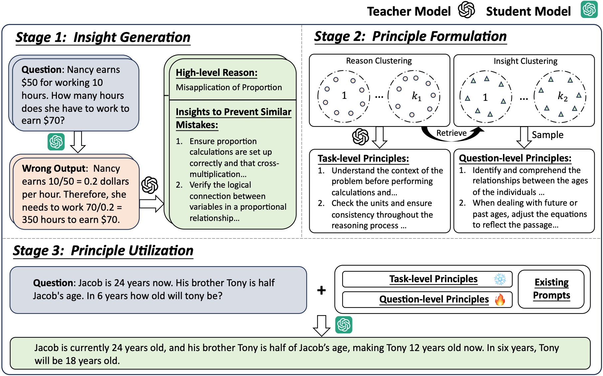

[Retrieved In-Context Principles from Previous Mistakes](https://arxiv.org/pdf/2407.05682) 

**Hao Sun**, Yong Jiang, Bo Wang, Yingyan Hou, Yan Zhang, Pengjun Xie, Fei Huang 

**Arxiv** 

**Enabling LLMs to learn from mistakes by proving question-level and task-level principles .**

 <a href="https://arxiv.org/pdf/2407.05682"><strong>Paper</strong></a>

Arxiv
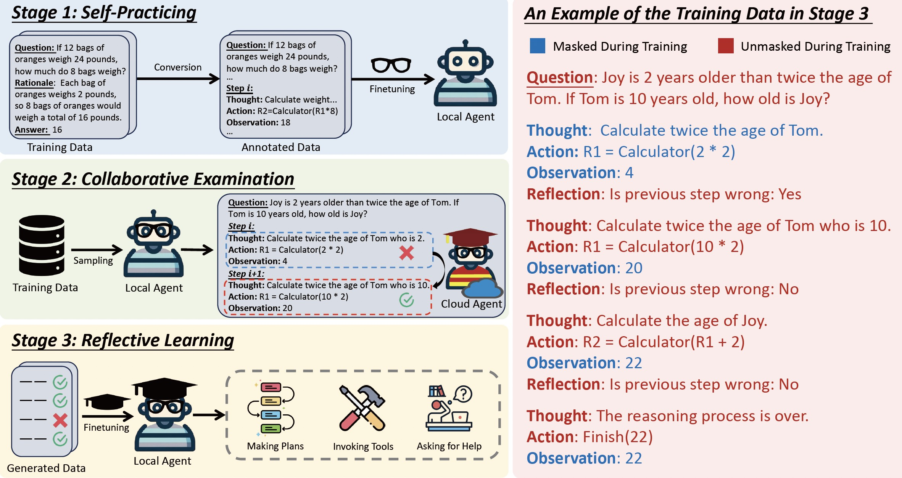

[AdaSwitch: Adaptive Switching between Small and Large Agents for Effective Cloud-Local Collaborative Learning](https://arxiv.org) 

**Hao Sun**, Jiayi Wu, Hengyi Cai, Xiaochi Wei, Yue Feng, Bo Wang, Shuaiqiang Wang, Yan Zhang, Dawei Yin 

**Arxiv** 

 <a href="https://arxiv.org"><strong>Paper</strong></a>

**Enabling adaptive switching between local agent and cloud agent through collaborative learning.**

Arxiv
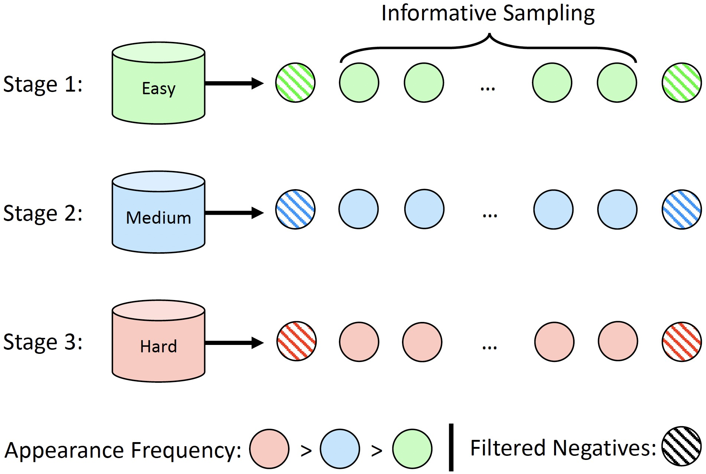

[SimCNS: Simple Curriculum Negative Sampling for Multi-Source Dense Retrieval](https://arxiv.org/)

**Hao Sun**, Xiao Liu, Yeyun Gong, Anlei Dong, Ge Shi, Yan Zhang, Linjun Yang, Nan Duan

**Arxiv** 

 <a href="https://arxiv.org"><strong>Paper</strong></a>

**Select the most important negative samples for multi-source dense retrieval**

# 📝 Publications

WSDM 2024
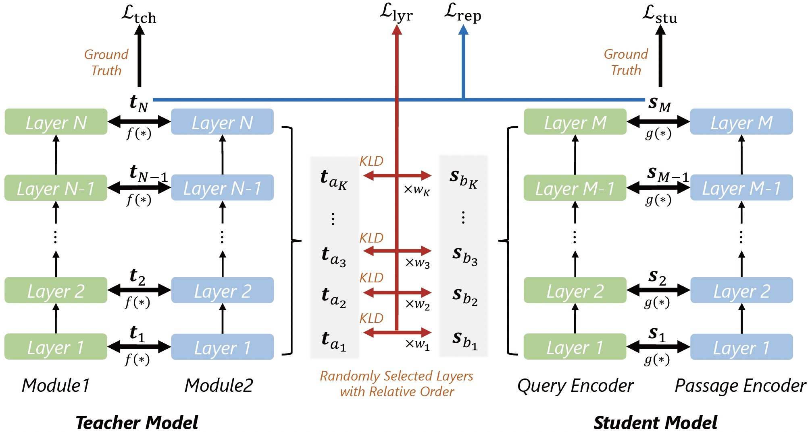

[LEAD: Liberal Feature-based Distillation for Dense Retrieval](https://arxiv.org/pdf/2212.05225.pdf) 

**Hao Sun**, Xiao Liu, Yeyun Gong, Anlei Dong, Jingwen Lu, Yan Zhang, Linjun Yang, Rangan Majumder, Nan Duan 

**WSDM 2024  (Oral)**

<a href="https://arxiv.org/pdf/2212.05225.pdf"><strong>Paper</strong></a>
\|
<a href="https://github.com/microsoft/SimXNS/tree/main/LEAD"><strong>Code</strong></a>

**Distill the intermediate features from teacher to student without the constraints on model architecture or tokenizers.**

EMNLP 2023
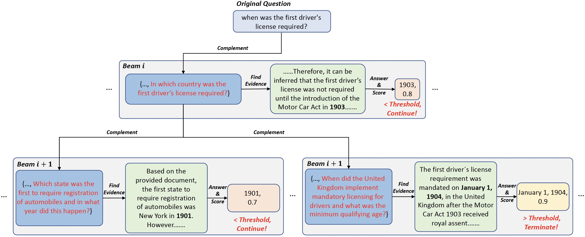

[Allies: Prompting Large Language Model with Beam Search](https://aclanthology.org/2023.findings-emnlp.247.pdf)  

**Hao Sun**, Xiao Liu, Yeyun Gong, Yan Zhang, Nan Duan

**EMNLP 2023  (Findings)** 

<a href="https://aclanthology.org/2023.findings-emnlp.247.pdf"><strong>Paper</strong></a>
\|
<a href="https://github.com/microsoft/SimXNS/tree/main/LEAD"><strong>Code</strong></a>

**Improving the knowledge scope and robustness of LLMs with Beam Search.**

ACL 2023
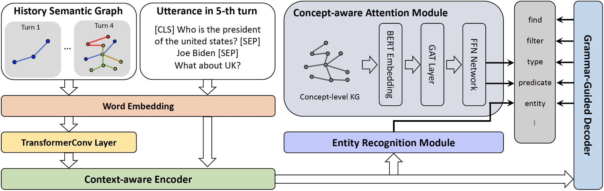

[History Semantic Graph Enhanced Conversational KBQA with Temporal Information Modeling](https://arxiv.org/pdf/2306.06872.pdf)  

**Hao Sun**, Yang Li, Liwei Deng, Bowen Li, Binyuan Hui, Binhua Li, Yunshi Lan, Yan Zhang, Yongbin Li

**ACL 2023** 

<a href="https://arxiv.org/pdf/2306.06872.pdf"><strong>Paper</strong></a>

**Modeling history conversation information with History Semantic Graph.**

SDM 2022
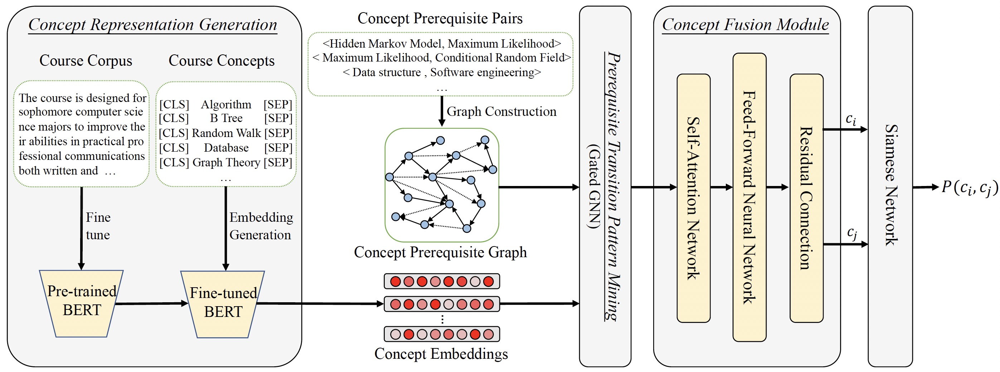

[ConLearn: Contextual-knowledge-aware Concept Prerequisite Relation Learning with Graph Neural Network](https://epubs.siam.org/doi/pdf/10.1137/1.9781611977172.14)  

**Hao Sun**, Yuntao Li, Yan Zhang

**SDM 2022**

<a href="https://epubs.siam.org/doi/pdf/10.1137/1.9781611977172.14"><strong>Paper</strong></a> 
\|
<a href="https://github.com/sunhaonlp/ConLearn"><strong>Code</strong></a>

**Capturing complex transition patterns between concepts through Graph Neural Network.**

CIKM 2021
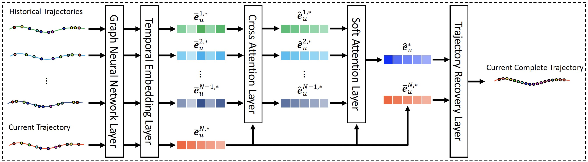

[PeriodicMove: Shift-aware Human Mobility Recovery with Graph Neural Network](https://dl.acm.org/doi/pdf/10.1145/3459637.3482284) 

**Hao Sun**, Changjie Yang, Liwei Deng, Fan Zhou, Feiteng Huang, Kai Zheng

**CIKM 2022**

<a href="https://dl.acm.org/doi/pdf/10.1145/3459637.3482284"><strong>Paper</strong></a>
\|
<a href="https://github.com/sunhaonlp/PeriodicMove"><strong>Code</strong></a>

**Capturing multi-level periodicity and shifting periodicity of human mobility using attention mechanism.**

DASFAA 2021
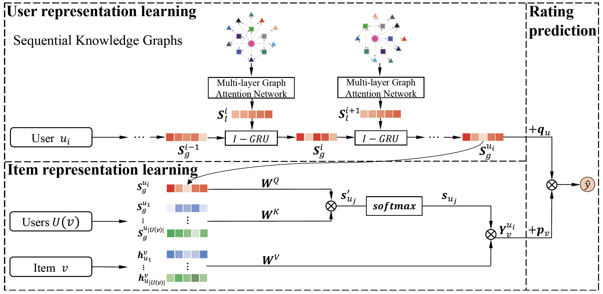

[Personalized Dynamic Knowledge-Aware Recommendation with Hybrid Explanations](https://link.springer.com/chapter/10.1007/978-3-030-73200-4_10)  

**Hao Sun**, Zijian Wu, Yue Cui, Liwei Deng, Yan Zhao, Kai Zheng

**DASFAA 2021**

<a href="https://link.springer.com/chapter/10.1007/978-3-030-73200-4_10"><strong>Paper</strong></a>
\|
<a href="https://github.com/sunhaonlp/PeriodicMove"><strong>Code</strong></a>

**Providing personalized and hybrid explanations for the recommendations.**

WSDM 2023
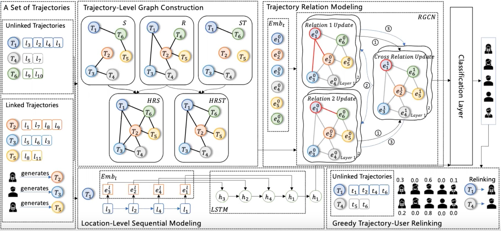

[S2TUL: A Semi-Supervised Framework for Trajectory-User Linking](https://dl.acm.org/doi/pdf/10.1145/3539597.3570410)  

Liwei Deng, **Hao Sun**, Yan Zhao, Shuncheng Liu, Kai Zheng 

**WSDM 2023**

<a href="https://link.springer.com/chapter/10.1007/978-3-030-73200-4_10"><strong>Paper</strong></a>
\|
<a href="https://github.com/sunhaonlp/PeriodicMove"><strong>Code</strong></a>

**Capture fine-grained intra-trajectory information by passing the trajectories into the sequential neural networks.**

NeurIPS 2022
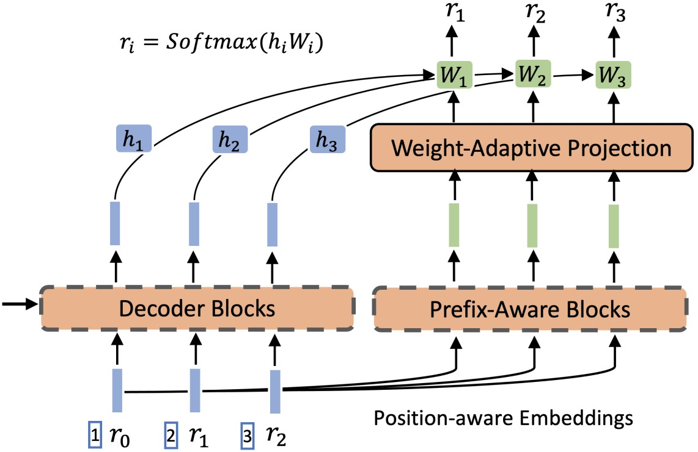

[A Neural Corpus Indexer for Document Retrieval](https://arxiv.org/pdf/2206.02743.pdf) 

Yujing Wang, Yingyan Hou, Haonan Wang, Ziming Miao, Shibin Wu, **Hao Sun**, Qi Chen, Yuqing Xia, Chengmin Chi, Guoshuai Zhao, Zheng Liu, Xing Xie, Hao Allen Sun, Weiwei Deng, Qi Zhang, Mao Yang

**NeurIPS 2022**

<a href="https://arxiv.org/pdf/2206.02743.pdf"><strong>Paper</strong></a>
\|
<a href="https://github.com/solidsea98/Neural-Corpus-Indexer-NCI"><strong>Code</strong></a>

**Propose an end-to-end differentiable document retrieval model that can significantly outperform both inverted index and dense retrieval solutions.**

CIKM 2022
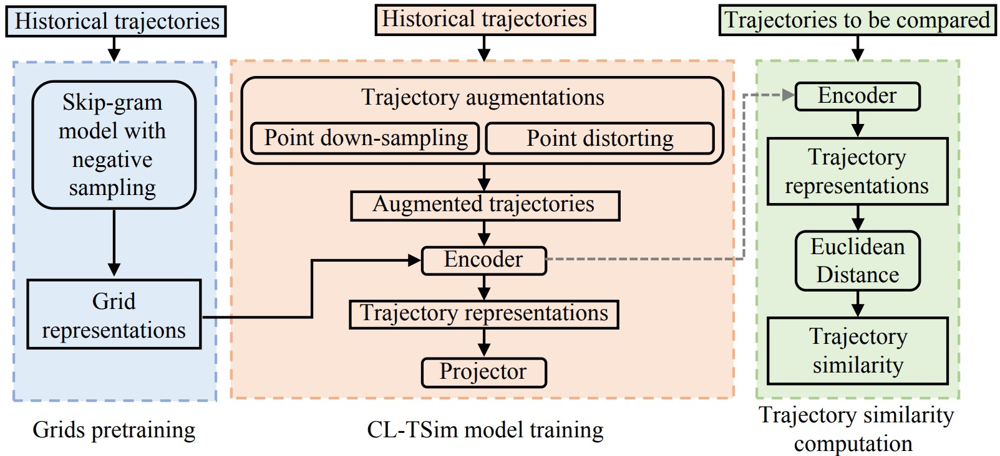

[Efficient Trajectory Similarity Computation with Contrastive Learning](https://dl.acm.org/doi/pdf/10.1145/3511808.3557308) 

Liwei Deng, Yan Zhao, Zidan Fu, **Hao Sun**, Shuncheng Liu, Kai Zheng 

**CIKM 2022**

<a href="https://dl.acm.org/doi/pdf/10.1145/3511808.3557308"><strong>Paper</strong></a> 

**Employ a contrastive learning mechanism to learn the latent representations of trajectories and then calculate the dissimilarity between trajectories based on these representations.**

CIKM 2022
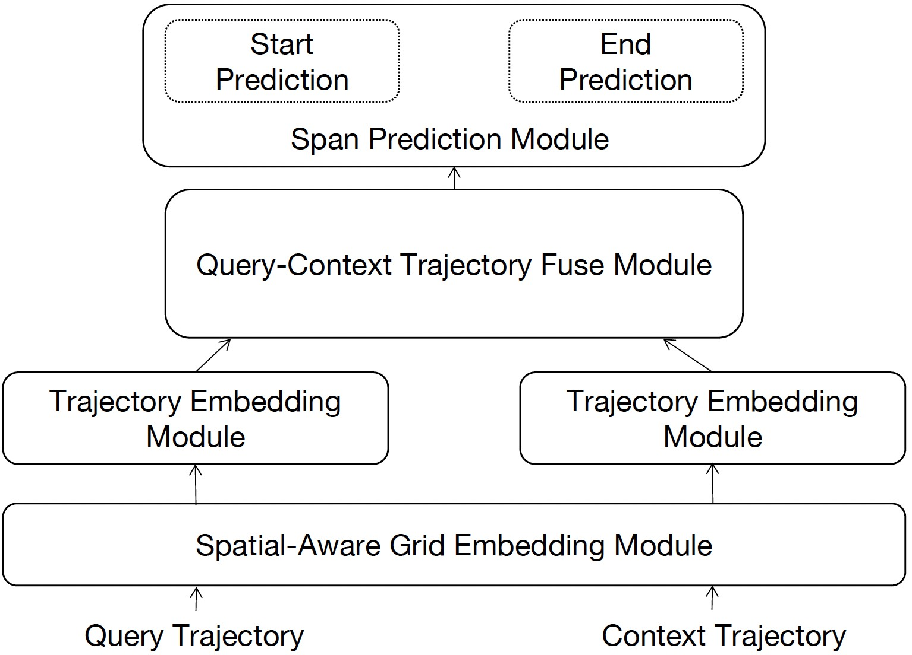

[Efficient and Effective Similar Subtrajectory Search: A Spatial-aware Comprehension Approach](https://dl.acm.org/doi/pdf/10.1145/3456723) 

Liwei Deng, **Hao Sun**, Rui Sun, Yan Zhao, Han Su

**TIST 2022**

<a href="https://dl.acm.org/doi/pdf/10.1145/3456723"><strong>Paper</strong></a> 

**Propose a Similar Subtrajectory Search with a Graph Neural Networks framework**

CIKM 2022
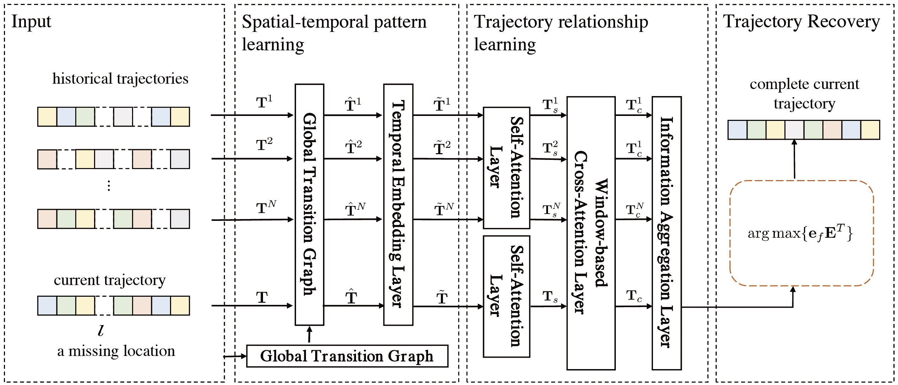

[Fusing Local and Global Mobility Patterns for Trajectory Recovery](https://link.springer.com/chapter/10.1007/978-3-031-30637-2_29) 

Liwei Deng, Yan Zhao, **Hao Sun**, Changjie Yang, Jiandong Xie, Kai Zheng

**CIKM 2022**

 <a href="https://link.springer.com/chapter/10.1007/978-3-031-30637-2_29"><strong>Paper</strong></a> 

 **Propose a neural attention model based on graph convolutional networks to enhance the accuracy of trajectory recovery**

CIKM 2022
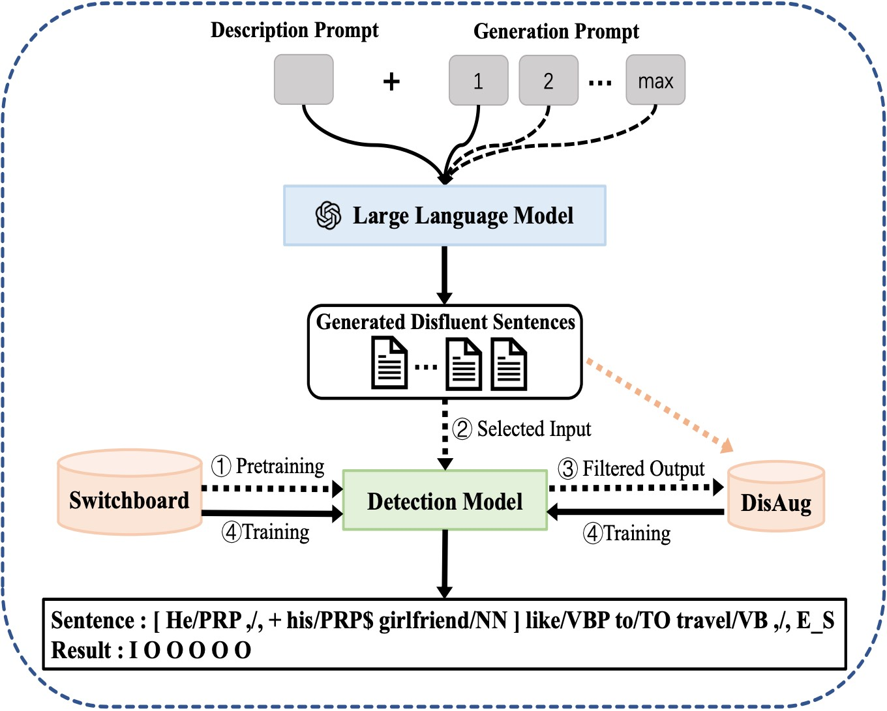

[Boosting Disfluency Detection with Large Language Model as Disfluency Generator](https://arxiv.org/pdf/2403.08229.pdf)

Zhenrong Cheng, Jiayan Guo, **Hao Sun**, Yan Zhang

**ICME 2024**

 <a href="https://arxiv.org/pdf/2403.08229.pdf"><strong>Paper</strong></a> 

**Propose a framework that addresses data sparsity issues by generating disfluent data using LLM as augmentation data.**

CIKM 2022
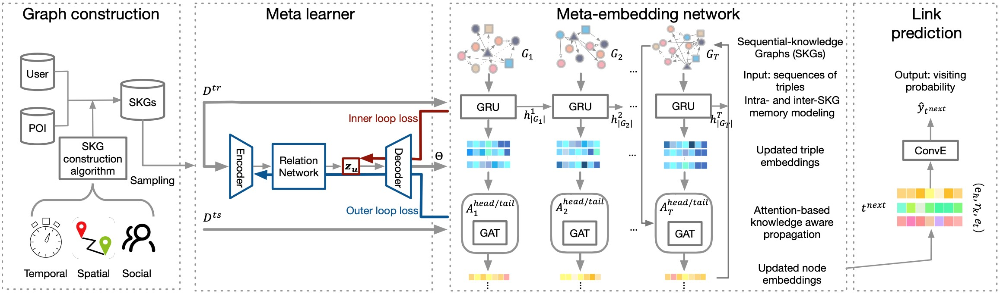

[Sequential-Knowledge-Aware Next POI Recommendation: A Meta-Learning Approach](https://dl.acm.org/doi/pdf/10.1145/3460198) 

Yue Cui, **Hao Sun**, Yan Zhao, Hongzhi Yin, Kai Zheng

**TOIS 2021**

 <a href="https://dl.acm.org/doi/pdf/10.1145/3460198"><strong>Paper</strong></a> 

**Propose a meta-learned sequential-knowledge-aware recommender (Meta-SKR), which utilizes sequential, spatiotemporal, and social knowledge to recommend the next POI for a location-based social network user.**

# 🎖 Honors and Awards

- *2024.06* First Prize of Challenge Cup Competition, Peking University.
- *2024.03* Academic Star Nomination.
- *2023.09* Merit Student of Peking University.
- *2023.09* Schlumberger Scholarship.
- *2023.08* Stars of Tomorrow Award at Microsoft, Microsoft.
- *2023.06* First Prize of Challenge Cup Competition, Peking University.
- *2022.12* Outstanding Paper Award, NeurIPS 2022.
- *2021.06* Outstanding Graduation Thesis for Undergraduates, UESTC.
- *2021.06* Outstanding Graduate, UESTC.
- *2019.12* National Scholarship.
- *2018.09* National Scholarship.

# 📖 Educations

- *2021.09 - Present*, Ph.D. Candidate, Peking University.
- *2017.09 - 2021.06*, Undergraduate, University of Electronic Science And Technology of China.

# 📚 Academic Services

- **Program Committee / Reviewer**: ACL 2022-23, EMNLP 2022-23, WWW 2023, IJCAI 2023
- **Secondary Reviewer**: AAAI 2022, CIKM 2021-22, ICDM 2021-23, COLING 2022-23, DASFAA 2022-23

# 👩🏻‍🏫 Teaching

- *Teaching Assistant,* Computer Networks and Web Technologies, Peking University, Fall 2023

# 💻 Internships

- [Baidu Research](http://research.baidu.com/), focusing on large language models.
- [Microsoft Research Asia (MSRA)](https://www.msra.cn/), focusing on dense retrieval.
- [DAMO Academy](https://damo.alibaba.com/), focusing on multi-turn conversation.
- [HUAWEI Research](https://www.huawei.com/en/), focusing on spatial-temporal data analysis.
