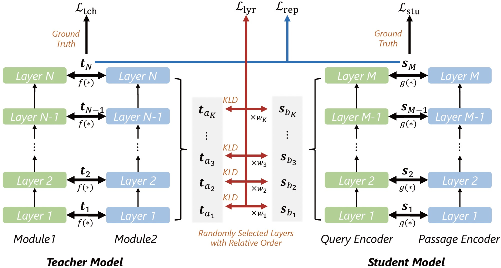








I'm now a Ph.D. candidate in [School of Intelligence Science and Technology ](https://www.cis.pku.edu.cn/index.htm) at [Peking University](https://www.pku.edu.cn/), working with Prof. [Y. Zhang](http://www.cis.pku.edu.cn/jzyg/szdw/zy.htm). I obtained my bachelor's degree from the [School of Computer Science and Engineering](https://www.scse.uestc.edu.cn/), [UESTC](https://www.uestc.edu.cn/) in June 2021, under the supervision of Prof. [K. Zheng](http://zheng-K..com/). I’ve also spent time at [Baidu](http://research.baidu.com/), [MSRA](https://www.msra.cn/), [Alibaba](https://www.alibaba.com/) and [Huawei](https://www.huawei.com/).

My current research interests include **Information Retrieval** and **Large Language Models**. If you are also interested, please feel free to drop me an email.

# 🔥 News
- *2024.09*: &nbsp;🎉🎉  My paper entitled “Towards Verifiable Text Generation with Evolving Memory and Self-Reflection” was accepted by [EMNLP 2024](https://2024.emnlp.org/)!
- *2024.09*: &nbsp;🎉🎉  My paper entitled “Retrieved In-Context Principles from Previous Mistakes” was accepted by [EMNLP 2024](https://2024.emnlp.org/)!
- *2024.09*: &nbsp;🎉🎉  My paper entitled “AdaSwitch: Adaptive Switching between Small and Large Agents for Effective Cloud-Local Collaborative Learning” was accepted by [EMNLP 2024](https://2024.emnlp.org/)!
- *2024.04*: &nbsp;🎉🎉  Nominated for the Academic Star Award!
- *2023.12*: &nbsp;🎉🎉  My paper entitled “Towards Verifiable Text Generation with Evolving Memory and Self-Reflection” is available on [Arxiv](http://arxiv.org/abs/2312.09075)!
- *2023.10*: &nbsp;🎉🎉  My paper entitled “LEAD: Liberal Feature-based Distillation for Dense Retrieval” was accepted by [WSDM 2024](https://www.wsdm-conference.org/2024/)! 
- *2023.10*: &nbsp;🎉🎉  My paper entitled “Allies: Prompting Large Language Model with Beam Search” was accepted by [EMNLP 2023](https://2023.emnlp.org/)!
- *2023.08*: &nbsp;🎉🎉  Awarded as Stars of Tomorrow during an internship at Microsoft!

# 📒 Preprint

Arxiv

[SimCNS: Simple Curriculum Negative Sampling for Multi-Source Dense Retrieval](https://arxiv.org/)

**Hao Sun**, X. Liu, Y. Gong, A. Dong, G. Shi, Y. Zhang, L. Yang, N. Duan

_Arxiv_, 2024

 <a href="https://arxiv.org"><strong>Paper</strong></a>

**Select the most important negative samples for multi-source dense retrieval**

# 📝 Publications

EMNLP

[Towards Verifiable Text Generation with Evolving Memory and Self-Reflection](https://arxiv.org/pdf/2312.09075.pdf) 
**Hao Sun**, H. Cai, B. Wang, Y. Hou, X. Wei, S. Wang, Y. Zhang, D. Yin 

_The Conference on Empirical Methods in Natural Language Processing_ (**EMNLP**), 2024

 <a href="https://arxiv.org/pdf/2312.09075.pdf"><strong>Paper</strong></a>

**Improving citation generation with a two-tier verifier and active retrieval mechanism.**

EMNLP

[Retrieved In-Context Principles from Previous Mistakes](https://arxiv.org/pdf/2407.05682) 

**Hao Sun**, Y. Jiang, B. Wang, Y. Hou, Y. Zhang, P. Xie, F. Huang 

_The Conference on Empirical Methods in Natural Language Processing_ (**EMNLP**), 2024

<a href="https://arxiv.org/pdf/2407.05682"><strong>Paper</strong></a>

**Enabling LLMs to learn from mistakes by proving question-level and task-level principles.**

EMNLP

[AdaSwitch: Adaptive Switching between Small and Large Agents for Effective Cloud-Local Collaborative Learning](https://arxiv.org/pdf/2410.13181) 

**Hao Sun**, J. Wu, H. Cai, X. Wei, Y. Feng, B. Wang, S. Wang, Y. Zhang, D. Yin 

_The Conference on Empirical Methods in Natural Language Processing_ (**EMNLP**), 2024

 <a href="https://arxiv.org/pdf/2410.13181"><strong>Paper</strong></a>

**Enabling adaptive switching between local agent and cloud agent through collaborative learning.**

WSDM 2024

[LEAD: Liberal Feature-based Distillation for Dense Retrieval](https://arxiv.org/pdf/2212.05225.pdf) 

**Hao Sun**, X. Liu, Y. Gong, A. Dong, J. Lu, Y. Zhang, L. Yang, R. Majumder, N. Duan 

_The ACM International Conference on Web Search and Data Mining_ (**WSDM**), 2024, Oral

<a href="https://arxiv.org/pdf/2212.05225.pdf"><strong>Paper</strong></a>
\|
<a href="https://github.com/microsoft/SimXNS/tree/main/LEAD"><strong>Code</strong></a>

**Distill the intermediate features from teacher to student without the constraints on model architecture or tokenizers.**

EMNLP 2023

[Allies: Prompting Large Language Model with Beam Search](https://aclanthology.org/2023.findings-emnlp.247.pdf)  

**Hao Sun**, X. Liu, Y. Gong, Y. Zhang, N. Duan

_The Conference on Empirical Methods in Natural Language Processing_ (**EMNLP**), 2023, Findings

<a href="https://aclanthology.org/2023.findings-emnlp.247.pdf"><strong>Paper</strong></a>
\|
<a href="https://github.com/microsoft/SimXNS/tree/main/LEAD"><strong>Code</strong></a>

**Improving the knowledge scope and robustness of LLMs with Beam Search.**

ACL 2023

[History Semantic Graph Enhanced Conversational KBQA with Temporal Information Modeling](https://arxiv.org/pdf/2306.06872.pdf)  

**Hao Sun**, Y.g Li, L. Deng, B. Li, B. Hui, B. Li, Y. Lan, Y. Zhang, Y. Li

_The Annual Meeting of the Association for Computational Linguistics_ (**ACL**), 2023

<a href="https://arxiv.org/pdf/2306.06872.pdf"><strong>Paper</strong></a>

**Modeling history conversation information with History Semantic Graph.**

SDM 2022

[ConLearn: Contextual-knowledge-aware Concept Prerequisite Relation Learning with Graph Neural Network](https://epubs.siam.org/doi/pdf/10.1137/1.9781611977172.14)  

**Hao Sun**, Y. Li, Y. Zhang

_The SIAM International Conference on Data Mining_ (**SDM**), 2022

<a href="https://epubs.siam.org/doi/pdf/10.1137/1.9781611977172.14"><strong>Paper</strong></a> 
\|
<a href="https://github.com/sunhaonlp/ConLearn"><strong>Code</strong></a>

**Capturing complex transition patterns between concepts through Graph Neural Network.**

CIKM 2021

[PeriodicMove: Shift-aware Human Mobility Recovery with Graph Neural Network](https://dl.acm.org/doi/pdf/10.1145/3459637.3482284) 

**Hao Sun**, C. Y.g, L. Deng, F. Zhou, F. Huang, K. Zheng

_The ACM International Conference on Information and Knowledge Management_ (**CIKM**), 2021

<a href="https://dl.acm.org/doi/pdf/10.1145/3459637.3482284"><strong>Paper</strong></a>
\|
<a href="https://github.com/sunhaonlp/PeriodicMove"><strong>Code</strong></a>

**Capturing multi-level periodicity and shifting periodicity of human mobility using attention mechanism.**

DASFAA 2021

[Personalized Dynamic Knowledge-Aware Recommendation with Hybrid Explanations](https://link.springer.com/chapter/10.1007/978-3-030-73200-4_10)  

**Hao Sun**, Z. Wu, Y. Cui, L. Deng, Y. Zhao, K. Zheng

_The International Conference on Database Systems for Advanced Applications_ (**DASFAA**), 2021

<a href="https://link.springer.com/chapter/10.1007/978-3-030-73200-4_10"><strong>Paper</strong></a>

**Providing personalized and hybrid explanations for the recommendations.**

WSDM 2023

[S2TUL: A Semi-Supervised Framework for Trajectory-User Linking](https://dl.acm.org/doi/pdf/10.1145/3539597.3570410)  

L. Deng, **Hao Sun**, Y. Zhao, S. Liu, K. Zheng 

_The ACM International Conference on Web Search and Data Mining_ (**WSDM**), 2023

<a href="https://dl.acm.org/doi/pdf/10.1145/3539597.3570410"><strong>Paper</strong></a>

**Capture fine-grained intra-trajectory information by passing the trajectories into the sequential neural networks.**

NeurIPS 2022

[A Neural Corpus Indexer for Document Retrieval](https://arxiv.org/pdf/2206.02743.pdf) 

Y. Wang, Y. Hou, H. Wang, Z. Miao, S. Wu, **Hao Sun**, Q. Chen, Y. Xia, C. Chi, G. Zhao, Z. Liu, X. Xie, H. Allen Sun, W. Deng, Q. Zhang, M. Yang

_The Annual Conference on Neural Information Processing Systems_ (**NeurIPS**), 2022

<a href="https://arxiv.org/pdf/2206.02743.pdf"><strong>Paper</strong></a>
\|
<a href="https://github.com/solidsea98/Neural-Corpus-Indexer-NCI"><strong>Code</strong></a>

**Propose an end-to-end differentiable document retrieval model that can significantly outperform both inverted index and dense retrieval solutions.**

CIKM 2022

[Efficient Trajectory Similarity Computation with Contrastive Learning](https://dl.acm.org/doi/pdf/10.1145/3511808.3557308) 

L. Deng, Y. Zhao, Z. Fu, **Hao Sun**, S. Liu, K. Zheng 

_The ACM International Conference on Information and Knowledge Management_ (**CIKM**), 2022

<a href="https://dl.acm.org/doi/pdf/10.1145/3511808.3557308"><strong>Paper</strong></a> 

**Employ a contrastive learning mechanism to learn the representations of trajectories, which are then used to calculate the dissimilarity between them.**

TIST 2022

[Efficient and Effective Similar Subtrajectory Search: A Spatial-aware Comprehension Approach](https://dl.acm.org/doi/pdf/10.1145/3456723) 

L. Deng, **Hao Sun**, R. Sun, Y. Zhao, H. Su

_The ACM Transactions on Intelligent Systems and Technology_ (**TIST**), 2022

<a href="https://dl.acm.org/doi/pdf/10.1145/3456723"><strong>Paper</strong></a> 

**Propose a Similar Subtrajectory Search with a Graph Neural Networks framework.**

CIKM 2022

[Fusing Local and Global Mobility Patterns for Trajectory Recovery](https://link.springer.com/chapter/10.1007/978-3-031-30637-2_29) 

L. Deng, Y. Zhao, **Hao Sun**, C. Yang, J. Xie, K. Zheng

_The ACM International Conference on Information and Knowledge Management_ (**CIKM**), 2022

 <a href="https://link.springer.com/chapter/10.1007/978-3-031-30637-2_29"><strong>Paper</strong></a> 

 **Propose a neural attention model based on graph convolutional networks to enhance the accuracy of trajectory recovery.**

ICME 2024

[Boosting Disfluency Detection with Large Language Model as Disfluency Generator](https://arxiv.org/pdf/2403.08229.pdf)

Z. Cheng, J. Guo, **Hao Sun**, Y. Zhang

_The IEEE International Conference on Multimedia & Expo_ (**ICME**), 2024

 <a href="https://arxiv.org/pdf/2403.08229.pdf"><strong>Paper</strong></a> 

**Propose a framework that addresses data sparsity issues by generating disfluent data using LLM as augmentation data.**

TOIS 2021

[Sequential-Knowledge-Aware Next POI Recommendation: A Meta-Learning Approach](https://dl.acm.org/doi/pdf/10.1145/3460198) 

Y. Cui, **Hao Sun**, Y. Zhao, H. Yin, K. Zheng

_The ACM Transactions on Information Systems_ (**TOIS**), 2021

 <a href="https://dl.acm.org/doi/pdf/10.1145/3460198"><strong>Paper</strong></a> 

**Utilize sequential, spatiotemporal, and social knowledge to recommend the next POI for a location-based social network user.**

# 🎖 Honors and Awards

- *2024.06* First Prize of Challenge Cup Competition, Peking University.
- *2024.03* Academic Star Nomination.
- *2023.09* Merit Student of Peking University.
- *2023.09* Schlumberger Scholarship.
- *2023.08* Stars of Tomorrow Award at Microsoft, Microsoft.
- *2023.06* First Prize of Challenge Cup Competition, Peking University.
- *2022.12* Outstanding Paper Award, NeurIPS 2022.
- *2021.06* Outstanding Graduation Thesis for Undergraduates, UESTC.
- *2021.06* Outstanding Graduate, UESTC.
- *2019.12* National Scholarship.
- *2018.09* National Scholarship.

# 📖 Educations

- *2021.09 - Present*, Ph.D. Candidate, Peking University.
- *2017.09 - 2021.06*, Undergraduate, University of Electronic Science And Technology of China.

# 📚 Academic Services

- **Program Committee / Reviewer**: ACL 2022-23, EMNLP 2022-23, WWW 2023, IJCAI 2023
- **Secondary Reviewer**: AAAI 2022, CIKM 2021-22, ICDM 2021-23, COLING 2022-23, DASFAA 2022-23

# 👩🏻‍🏫 Teaching

- *Teaching Assistant,* Computer Networks and Web Technologies, Peking University, Fall 2023

# 💻 Internships

- [Baidu Research](http://research.baidu.com/), focusing on large language models.
- [Microsoft Research Asia (MSRA)](https://www.msra.cn/), focusing on dense retrieval.
- [DAMO Academy](https://damo.alibaba.com/), focusing on multi-turn conversation.
- [HUAWEI Research](https://www.huawei.com/en/), focusing on spatial-temporal data analysis.
